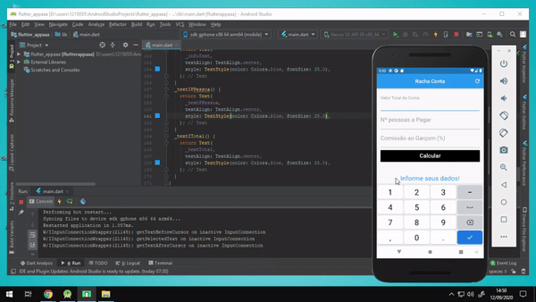

# RachaConta

Um app feito com a intenção de se dividir uma conta entre as pessoas ali presentes, incluindo tambêm a comissão para o garçom, utilizando o Dart.

Após inserir o valor total da conta, o numero de pessoas que irá dividir a conta, e o percentual da conta que será pago ao garçom, o app calcula qual será o valor que o garçom recebrá, cada pessoa terá de pagar e o valor total somado ao pagamento do garçom.

Utilizando de funções para pegar os dados digitados pelo usuario, utilizo uma segunda função para fazer as contas e na mesma, mostro o resultado desejado.
